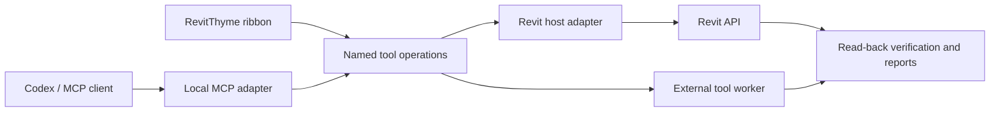

# Architecture

## Modules and responsibilities

The host owns execution in Revit. A tool owns its workflow. A small operation interface is the seam between callers and tool implementations; a host adapter supplies Revit-specific execution behind that interface.

Version 0.2.0 implements the pyRevit ribbon and shared read-only operations. Named loopback Routes execute through pyRevit ExternalEvent. A standalone MCP adapter, writes and jobs remain planned. See [implemented operations](OPERATIONS.md).

The 0.3.0 source preview adds a modal [Visual View Range](VISUAL-VIEW-RANGE.md) ribbon workflow. Its host boundary extracts scalars once, and the WPF UI slices cached triangles and stages range offsets without Revit API calls. Explicit Apply returns to the ribbon API context for validation, transaction, read-back and grouped rollback. The existing Routes dispatcher remains read-only; no remote mutation endpoint is added.

| Module | Responsibility | Initial approach |
| --- | --- | --- |
| Host adapter | Session/document identity, queued API execution, transactions and Revit diagnostics | Current pyRevit bridge; then a C# pilot |
| TimberFold | Extraction, fabrication geometry, nesting, documentation and CAD verification | Existing IronPython entry points and separate CPython worker |
| Operation interface | Validated arguments, declared effects, stable results and job identity | Small draft interface below |
| MCP adapter | Discoverable named tools and structured results | Separate local process; implementation language remains open |
| Ribbon/UI | Settings, preview, progress and result access | pyRevit extension ribbon for read-only operations |

Keep language-specific libraries inside each implementation. Cross-process workers exchange serializable data and artifact paths, not live Revit objects. Geometry can run outside Revit; live extraction and native export must return to a valid Revit execution context.

## Host constraints

External requests queue into Revit through supported mechanisms such as ExternalEvent. The host re-resolves the document and elements when executing, since the active document or model can change while a job waits. A session/document token must identify the intended document; a display title alone is insufficient.

Model changes use transactions with rollback on failure. Group related document changes into an undoable operation where Revit permits it. File creation and external-worker side effects cannot be undone by a Revit transaction: keep a unique run directory and report partial artifacts on failure.

Long computations should run in an external worker while Revit's UI remains usable. Revit API access stays within its valid execution context. The existing TimberFold launcher synchronously waits for its worker, so job handling requires implementation work.

## Draft operation interface

| Operation | Result | Declared effects |
| --- | --- | --- |
| `revitthyme_status` | Host version, session identity, document identity and readiness | Read-only |
| `timberfold_inspect` | Tool readiness, intended document, source scope/counts and obvious unsupported conditions | Read model; report data |
| `timberfold_preview` | Effective settings, extracted scope, geometry/packing diagnostics and preview artifacts | Read model; write a new run folder; no persistent document changes |
| `timberfold_generate` | Job ID, generated files, new review-view/sheet IDs and verification | Read model; create documentation and files; preserve source building geometry; no save/sync |
| `timberfold_verify` | Verification scope and evidence for a specific run | Read files/model; write report; native DWG checks may use temporary rollback-protected model changes |
| `get_job_status` | State, progress, diagnostics and partial/final artifact paths | Read job record |

Status and inspect are implemented read-only in v0.2.0. The other operations below remain proposals. Detailed geometry diagnostics require actual extraction and the worker; inspect must not claim complete support from a category count alone. The existing launcher runs extraction through generation and verification together. Splitting preview/generate/verify is adapter work, not an existing supported split of that launcher.

Requests should identify the operation, request ID, target session/document and validated parameters. A generate request should reference the preview of those same settings and scope. The host checks the preview's source/settings identity again before execution; stale previews return a diagnostic and require regeneration.

Results should include operation/host/tool versions, source identity, resolved settings, status, changed/skipped IDs, artifact locations and verification evidence. Preserve TimberFold part IDs and inverse 2D-to-3D transforms in its reports. Keep file names and paths associated with a specific run.

## Job behavior

Draft states: `queued`, `running`, `cancel_requested`, `cancelled`, `succeeded`, `failed`.

- A retry with the same accepted request ID returns the existing job rather than creating another set of sheets. Enforce this in implementation; a metadata field alone is insufficient.
- Serialize conflicting writes to the same document. Readiness includes Revit edit/modal states and an explicit diagnostic when execution must wait.
- Cancellation is cooperative at safe stage transitions. It rolls back an active uncommitted document transaction; it does not promise to terminate an arbitrary Revit API call or erase committed work/files.
- A failed job returns its failing stage, rollback outcome and partial artifact paths. Success requires the declared verification to pass.

## Implementation order

Use the existing bridge for the first read-only operations. Build a focused C# host pilot next, rather than duplicating all pyRevit functionality. Compare both implementations through the same operation interface. Add only the registration and execution structure required by working tools; defer a general plugin framework until another tool demonstrates the need.

The native pilot's .NET target and SDK references will be checked against the installed Revit 2027 build. Python/TypeScript/other runtimes can be external workers or callers; choosing another language does not bypass Revit's execution constraints.

## References

- [pyRevit architecture](https://docs.pyrevitlabs.io/architecture/)
- [pyRevit extensions and script engines](https://github.com/pyrevitlabs/pyRevit/blob/develop/docs/extensions.md)
- [pyRevit Routes](https://docs.pyrevitlabs.io/reference/pyrevit/routes/)
- [Autodesk ExternalEvent execution](https://help.autodesk.com/cloudhelp/2026/ENU/Revit-API-MainReference/files/html/13bf4411-c400-dcd2-458c-7f09357d9ecb.htm)
- [Autodesk transactions](https://help.autodesk.com/cloudhelp/2024/ENU/Revit-API/files/Revit_API_Developers_Guide/Basic_Interaction_with_Revit_Elements/Revit_API_Revit_API_Developers_Guide_Basic_Interaction_with_Revit_Elements_Transactions_html.html)
- [MCP architecture](https://modelcontextprotocol.io/docs/learn/architecture)

The Autodesk links explain execution concepts; check the installed Revit 2027 SDK for implementation-specific types and framework targets.
