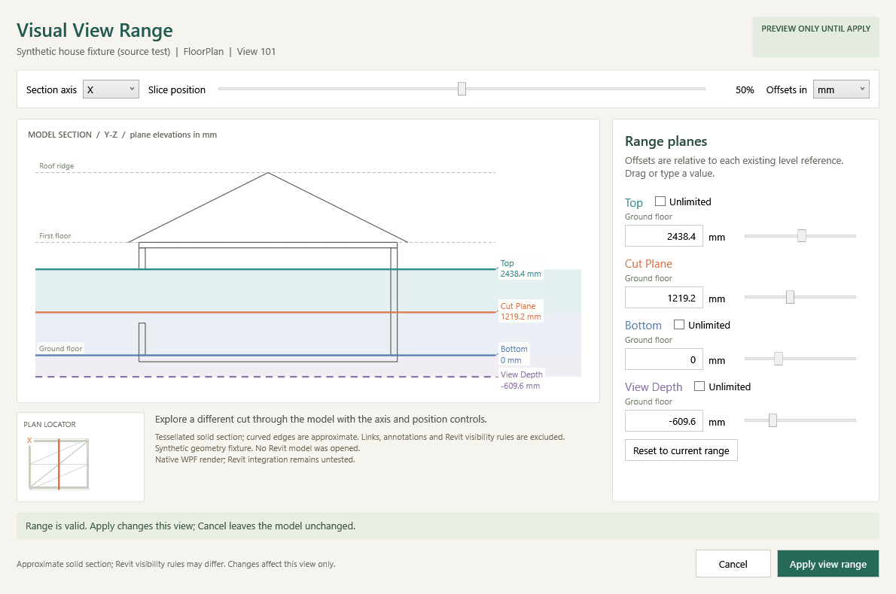

# Visual View Range (0.3.0 source preview)

Open a floor, structural or reflected ceiling plan and choose **RevitThyme > Documentation > Visual View Range**. This draft is not installed or released. The existing 0.2.0 installation remains unchanged.

The editor slices cached solids from the actual local model, draws the slice in elevation, and overlays Top, Cut Plane, Bottom and View Depth. Use the X/Y axis and slice-position slider to explore different cuts through the house. The locator projects a bounded sample of the same model triangles and marks the cut. The preview does not create a Revit section, modify geometry or open a temporary transaction.

Each range slider and numeric field edits an offset relative to its displayed existing level reference. Units are explicitly mm, m or decimal feet; switching units preserves the physical offset. Current, Level Above and Level Below references are resolved against the associated level using project-origin elevations, independent of shared datum display. Existing references are retained. An Unlimited plane has no finite preview line; returning it to a finite range uses its original reference, or the associated level if it was originally Unlimited. Cut Plane must remain finite. Revit's range-validity check is the final authority on supported Unlimited settings and view-specific restrictions.

Dragging only changes cached preview data. **Apply view range** is the explicit confirmation; **Cancel**, Escape and closing the editor discard staged changes. Reset restores the range captured when the editor opened. Revit view-template control, read-only projects, dependent views, primary plans with dependent children, unsupported view types and unresolved reference levels produce a useful refusal before editing. Use the standard View Range dialog for dependent-view families until propagated changes are qualified.

Apply rechecks session/document/view identity, reference levels, template restrictions and the original range. It validates plane ordering and calls `CheckPlanViewRangeValidity`, then sets only this view's range in a transaction. It checks the transaction's status and reads back all four references and offsets before completing the undo group. A failed set, regeneration, commit or read-back rolls the group back. Failure messages cause rollback rather than automatic resolution. If Revit cannot confirm rollback, the result says so and does not claim success. One Undo restores an applied range. The tool never saves, synchronizes, closes a model, edits a template or exposes a mutating Routes endpoint.

## Context limits

This is a tessellated geometry slice, not Revit's final section or plan visibility renderer. Curved faces are approximate; tessellation edges can remain visible. It includes selected architectural, structural, furniture and services categories across the local document, including other phases, design options and hidden categories. Links, annotation and symbolic curves are excluded. Crop regions, plan regions, underlays, view filters and special category visibility rules are not simulated. This is useful spatial context for the global View Range, not a promise that every shaded object appears in the final plan.

Extraction stops at 1,500 elements or 50,000 triangles and displays partial-context diagnostics. No geometry is written to disk. Section and range movement use this cached data; reopen the editor to refresh model context. Large models and IronPython performance still need live qualification. Revit 2027 is the source target; other versions are refused rather than claimed as supported.

## Verification

This screenshot uses the actual editor and a synthetic geometry fixture. It is not a screenshot of the user's house or an installed Revit session.

`project.cmd check-view-range` runs Windows source fixtures for geometry intersections/openings/instance coordinates/caps, level references, invalid/stale settings and transaction/rollback/read-back boundaries. `project.cmd check-view-range-ui` uses the installed pyRevit IronPython assemblies to load the actual editor with a synthetic house mesh and isolated pyRevit shim. Its screenshot and control checks qualify standalone IronPython/WPF behavior, not a real project or Revit transaction. The UI fixture requires those existing assemblies; it does not install them.

`project.cmd check-release` verifies the versioned ZIP and sandbox installer lifecycle. `project.cmd check-public-ci` also runs the new feature fixtures. Package checks install only into disposable temporary directories; they do not load the code into Revit. Full local CI and actual Revit results must be recorded separately.

Actual Revit geometry extraction, template restrictions, Apply/Undo and read-back remain unverified. The next proposed runtime step is to install the draft extension while Revit is closed, open an approved disposable copy of a small project, and check a floor and ceiling plan, Cancel, Apply, Undo and deliberate invalid/stale cases without saving. That step requires the user's approval; source/package tests do not satisfy it.
